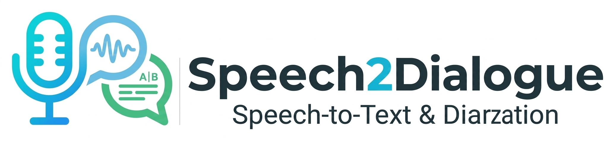

<p align="center">
  
</p>

<p align="center">
  🎙️ 语音/🎬 视频转对话、脚本、字幕生成器<br>
</p>

<p align="center">
  
  
  
</p>

---

## 功能特性

- 🎙️ **语音转文字**: 支持多种离线模型 (faster-whisper, whisperx, wav2vec2)
- 🔊 **降噪处理**: 支持音频降噪 (noisereduce)
- 👥 **说话人分离**: 支持说话人分离 (pyannote)
- 🎵 **声纹识别**: 支持声纹特征提取和比对 (speechbrain)
- 📄 **多格式输出**: JSON, TXT, SRT, VTT, CSV, 纯文本

## 项目结构

```
speech2dialogue/
├── pyproject.toml           # Python 包配置
├── README.md               # 项目文档
├── requirements.txt        # 依赖列表
├── transcriber.py          # 命令行入口
├── download_models.py      # 模型下载工具
├── speech2dialogue/        # 主包
│   ├── __init__.py         # API 导出
│   ├── cli.py             # 命令行接口
│   ├── configs.py         # 配置管理
│   ├── core/               # 核心模块
│   │   ├── processor.py    # 音频处理器
│   │   ├── diarizer.py     # 说话人分离
│   │   └── exporter.py     # 对话导出器
│   └── utils/              # 工具模块
│       ├── video.py        # 视频处理
│       ├── audio.py        # 音频处理
│       └── voiceprint.py   # 声纹识别
└── models/                 # 模型目录 (需下载)
```

## 快速开始

### 1. 安装依赖

```bash
# 克隆项目
git clone https://github.com/yourname/speech2dialogue.git
cd speech2dialogue

# 安装 Python 依赖
pip install -r requirements.txt

# 安装 ffmpeg (用于处理视频)
# Ubuntu/Debian
sudo apt-get install ffmpeg
# MacOS
brew install ffmpeg
```

### 2. 安装为 Python 包 (可选)

```bash
# 开发模式安装
pip install -e .

# 完成后可以使用命令行工具
speech2dialogue --help
```

### 3. 下载模型

```bash
# 验证已安装的模型
python download_models.py --verify

# 下载所有模型
python download_models.py --download all

# 下载特定模型
python download_models.py --download faster-whisper
python download_models.py --download pyannote
```

模型会自动下载到 `models/` 目录：

| 模型 | 默认路径 | 说明 |
|------|----------|------|
| faster-whisper | `models/faster-whisper-large-v3-turbo/` | 语音识别 (推荐) |
| pyannote | `models/pyannote/speaker-diarization-community-1/` | 说话人分离 |
| speechbrain | `models/speechbrain/spkrec-xvect-voxceleb/` | 声纹识别 |

## 使用方法

### 命令行

```bash
# 处理音频文件
python transcriber.py audio.mp3

# 处理视频文件 (自动提取音频)
python transcriber.py video.mp4

# 指定说话人数量
python transcriber.py audio.mp3 --speakers 2

# 启用降噪
python transcriber.py audio.mp3 --denoise

# 指定语言 (zh, en, ja 等)
python transcriber.py audio.mp3 --language zh

# 禁用说话人分离
python transcriber.py audio.mp3 --no-diarization

# 批量处理目录下所有音视频
python transcriber.py ./audio_files --batch

# 强制使用 CPU
python transcriber.py audio.mp3 --cpu

# 指定输出目录
python transcriber.py audio.mp3 --output ./my_outputs

# 使用声纹识别辅助说话人分离 (更精确)
python transcriber.py audio.mp3 --voiceprint

# 使用声纹识别，设置相似度阈值
python transcriber.py audio.mp3 --voiceprint --voiceprint-threshold 0.8

# 使用其他模型
python transcriber.py audio.mp3 --model wav2vec2
```

### Python API

```python
from speech2dialogue import OfflineAudioProcessor, DialogueExporter

# 创建处理器
processor = OfflineAudioProcessor(
    model_dir="./models",
    device="cuda"  # 或 "cpu"
)

# 加载模型
processor.load_faster_whisper()
processor.load_diarization()

# 处理音频
result = processor.process_audio(
    audio_path="audio.mp3",
    language="zh",
    enable_diarization=True,
    enable_noise_reduction=False
)

# 导出对话
dialogues = DialogueExporter.format_dialogues(result)
DialogueExporter.save_all_formats(dialogues, "output", "./outputs")
```

### 高级用法

```python
from speech2dialogue import (
    ModelConfig,
    ProcessConfig,
    DeviceConfig,
    OfflineAudioProcessor,
)

# 自定义配置
model_config = ModelConfig()
model_config.MODEL_ROOT = Path("./my_models")

process_config = ProcessConfig()
process_config.MERGE_GAP_THRESHOLD = 1.0  # 对话合并间隔
process_config.NOISE_REDUCTION_ENABLE = True

device_config = DeviceConfig.from_args(cpu=False)

# 使用自定义配置
processor = OfflineAudioProcessor(
    model_config=model_config,
    process_config=process_config,
    device_config=device_config
)
```

### 声纹识别 (高级功能)

声纹识别模块用于：
- **说话人聚类**: 基于声纹特征对说话人进行二次聚类，提高分离准确率
- **说话人比对**: 判断两段音频是否为同一人
- **说话人验证**: 验证音频中是否是声称的说话人

#### 1. 独立使用声纹识别

```python
from speech2dialogue import VoicePrintRecognizer
import numpy as np

# 初始化
vp = VoicePrintRecognizer(model_dir="./models", device="cpu")

# 加载模型
vp.load_model()

# 从文件提取声纹
embedding1 = vp.extract_embedding("speaker1.wav")
embedding2 = vp.extract_embedding("speaker2.wav")

# 比对相似度
similarity = vp.compare_speakers(embedding1, embedding2)
print(f"相似度: {similarity:.2f}")  # 0-1 之间，越高越可能是同一人
```

#### 2. 在处理流程中使用声纹聚类

```python
from speech2dialogue import OfflineAudioProcessor, DialogueExporter

# 创建处理器
processor = OfflineAudioProcessor(model_dir="./models", device="cpu")

# 加载所有需要的模型
processor.load_faster_whisper()
processor.load_diarization()
processor.load_voiceprint()  # 加载声纹模型

# 处理音频（包含声纹聚类）
result = processor.process_audio(
    audio_path="dialogue.wav",
    language="zh",
    enable_diarization=True,
    enable_voiceprint=True,  # 启用声纹聚类
    voiceprint_threshold=0.75  # 相似度阈值
)

# 导出结果
dialogues = DialogueExporter.format_dialogues(result)
DialogueExporter.save_all_formats(dialogues, "output", "./outputs")
```

#### 3. 声纹相似度参考

| 相似度范围 | 判断结果 |
|-----------|----------|
| > 0.85 | 极大概率是同一人 |
| 0.70 - 0.85 | 可能是同一人，需要人工确认 |
| 0.50 - 0.70 | 不确定 |
| < 0.50 | 大概率是不同人 |

## 参数说明

### 命令行参数

| 参数 | 说明 | 默认值 |
|------|------|--------|
| `input` | 输入文件或目录 | 必填 |
| `--model` | 语音识别模型 | `faster-whisper` |
| `--language` | 语言代码 | 自动检测 |
| `--speakers` | 说话人数量 | 自动检测 |
| `--no-diarization` | 禁用说话人分离 (pyannote) | False |
| `--denoise` | 启用降噪 | False |
| `--voiceprint` | 使用声纹识别辅助分离 | False |
| `--voiceprint-threshold` | 声纹相似度阈值 (0-1) | 0.75 |
| `--output` | 输出目录 | `./outputs` |
| `--cpu` | 强制使用 CPU | False |
| `--batch` | 批量处理模式 | False |
| `--model-dir` | 模型目录 | `./models` |
| `--token` | HuggingFace token | None |

### 支持的模型

| 模型名称 | 说明 | 特点 |
|----------|------|------|
| `faster-whisper` | Faster Whisper Large V3 Turbo | 速度快，支持多语言 (推荐) |
| `whisperx` | WhisperX | 精度高，支持对齐 |
| `wav2vec2` | Wav2Vec2 Chinese | 轻量，中文专注 |

## 输出格式

处理完成后会在 `outputs/` 目录生成以下文件：

| 格式 | 文件名 | 说明 |
|------|--------|------|
| JSON | `*.json` | 完整对话数据 |
| TXT | `*.txt` | 带时间戳的对话 |
| SRT | `*.srt` | SRT 字幕格式 |
| VTT | `*.vtt` | VTT 字幕格式 |
| CSV | `*.csv` | 表格形式 |
| Clean | `*_clean.txt` | 纯对话文本 |

### JSON 输出示例

```json
[
  {
    "speaker": "A",
    "text": "你好，今天天气真不错。",
    "start": 0.0,
    "end": 3.5,
    "duration": 3.5
  },
  {
    "speaker": "B",
    "text": "是啊，我们出去走走吧。",
    "start": 3.8,
    "end": 6.2,
    "duration": 2.4
  }
]
```

## 常见问题

### 1. 模型下载失败

- 检查网络连接
- 尝试使用镜像源
- 手动下载模型文件到对应目录

### 2. 内存不足

- 使用 `--cpu` 参数减少内存占用
- 减小批处理大小
- 使用更小的模型 (如 `faster-whisper-base`)

### 3. 说话人分离不准确

- 使用 `--speakers` 指定说话人数量
- 确保音频质量良好
- 尝试禁用降噪 (`--no-denoise`)

### 4. 识别结果为空

- 检查音频文件是否正常
- 确认语言设置正确
- 尝试使用其他模型

## 开发指南

### 运行测试

```bash
# 安装测试依赖
pip install pytest pytest-cov

# 运行测试
pytest tests/

# 生成覆盖率报告
pytest --cov=speech2dialogue tests/
```

### 代码规范

```bash
# 安装开发依赖
pip install -e ".[dev]"

# 代码格式化
black speech2dialogue/

# 代码检查
ruff check speech2dialogue/

# 类型检查
mypy speech2dialogue/
```

## 使用案例

### 案例一：视频字幕生成

将视频转换为 SRT/VTT 字幕文件，适用于视频压制、字幕翻译等场景。

```bash
# 1. 提取视频音频并生成字幕
python transcriber.py video.mp4 --language zh

# 2. 输出文件
# outputs/video.srt    # SRT 字幕 (可压制到视频)
# outputs/video.vtt   # VTT 字幕 (网页字幕)
```

**输出示例 (SRT):**
```
1
00:00:00,000 --> 00:00:05,500
说话人A: 你好，今天天气真不错。

2
00:00:06,000 --> 00:00:09,000
说话人B: 是啊，我们出去走走吧。
```

---

### 案例二：语音转说话人剧本

将会议、访谈音频转换为带说话人标记的剧本格式。

```bash
# 1. 处理音频，启用说话人分离
python transcriber.py meeting.wav --speakers 3 --language zh

# 2. 查看输出
# outputs/meeting.json      # 完整数据
# outputs/meeting_clean.txt # 纯对话文本
```

**输出示例 (JSON):**
```json
[
  {
    "speaker": "说话人A",
    "text": "大家好，欢迎参加本次会议。",
    "start": 0.0,
    "end": 3.5,
    "duration": 3.5
  },
  {
    "speaker": "说话人B", 
    "text": "谢谢主持人，我先介绍一下本次议题。",
    "start": 3.8,
    "end": 8.2,
    "duration": 4.4
  }
]
```

**输出示例 (Clean TXT):**
```
说话人A: 大家好，欢迎参加本次会议。
说话人B: 谢谢主持人，我先介绍一下本次议题。
说话人A: 好的，请讲。
```

---

### 案例三：有声书/播客转文字

将长音频转换为结构化文本，方便后期编辑。

```bash
# 1. 处理长音频，启用降噪提高质量
python transcriber.py podcast.wav --denoise --language zh

# 2. 批量处理多个文件
python transcriber.py ./podcasts --batch --language zh

# 3. 输出 CSV 方便在 Excel 中编辑
# outputs/podcast.csv
```

---

### 案例四：访谈节目处理

处理两人或多人的访谈视频。

```bash
# 1. 指定说话人数量
python transcriber.py interview.mp4 --speakers 2 --language zh

# 2. 启用声纹识别辅助分离 (需要网络)
python transcriber.py interview.mp4 --speakers 2 --voiceprint

# 3. 输出多格式文件
# interview.json  - 程序读取
# interview.txt   - 时间轴查看
# interview.srt  - 字幕压制
```

---

### 案例五：Python API 高级用法

```python
from speech2dialogue import OfflineAudioProcessor, DialogueExporter
from pathlib import Path

# 创建处理器
processor = OfflineAudioProcessor(
    model_dir="./models",
    device="cuda"  # 使用 GPU 加速
)

# 加载模型
processor.load_faster_whisper()
processor.load_diarization()

# 处理音频
result = processor.process_audio(
    audio_path="dialogue.wav",
    language="zh",
    enable_diarization=True,
    num_speakers=2,
    enable_noise_reduction=True
)

# 自定义处理
dialogues = DialogueExporter.format_dialogues(
    result,
    merge_gap=1.0,  # 合并间隔
    speaker_mapping={
        "SPEAKER_00": "主持人",
        "SPEAKER_01": "嘉宾A",
        "SPEAKER_02": "嘉宾B"
    }
)

# 保存特定格式
DialogueExporter.save_json(dialogues, "output", "./outputs")
```

---

### 案例六：批量处理工作流

```bash
# 1. 批量处理整个目录
python transcriber.py ./audio_files --batch --cpu

# 2. 指定输出目录
python transcriber.py ./audio_files --batch --output ./my_results

# 3. 全部使用 CPU (节省显存)
python transcriber.py ./audio_files --batch --cpu --no-diarization
```

---

### 案例七：生成多种格式用于不同场景

```bash
# 处理音频
python transcriber.py audio.mp3 --language zh

# 查看输出目录
ls outputs/

# audio.json     # 完整数据结构
# audio.txt      # 带时间轴
# audio.srt      # 字幕文件
# audio.vtt      # WebVTT 字幕
# audio.csv      # 表格数据
# audio_clean.txt # 纯对话
```

## 许可证

MIT License

## 致谢

- [Faster Whisper](https://github.com/SYSTRAN/faster-whisper) - 高速 Whisper 实现
- [PyAnnote](https://github.com/pyannote/pyannote-audio) - 说话人分离
- [SpeechBrain](https://github.com/speechbrain/speechbrain) - 声纹识别
